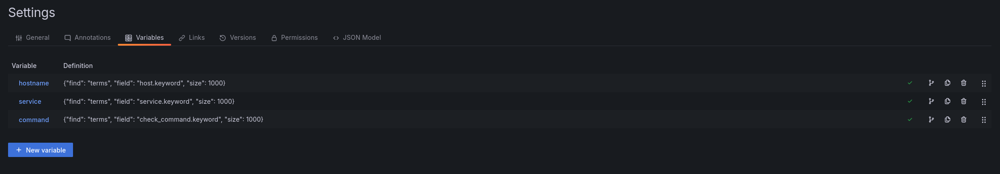
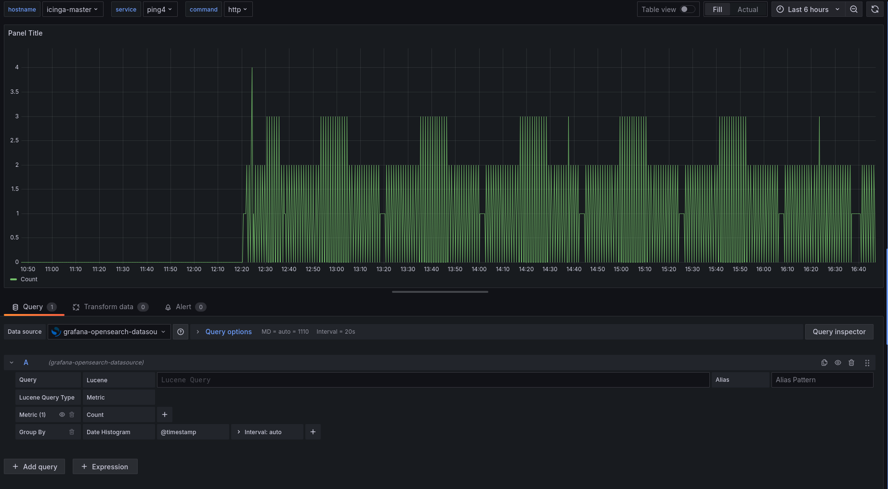
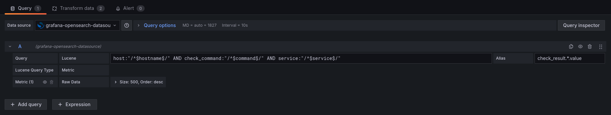
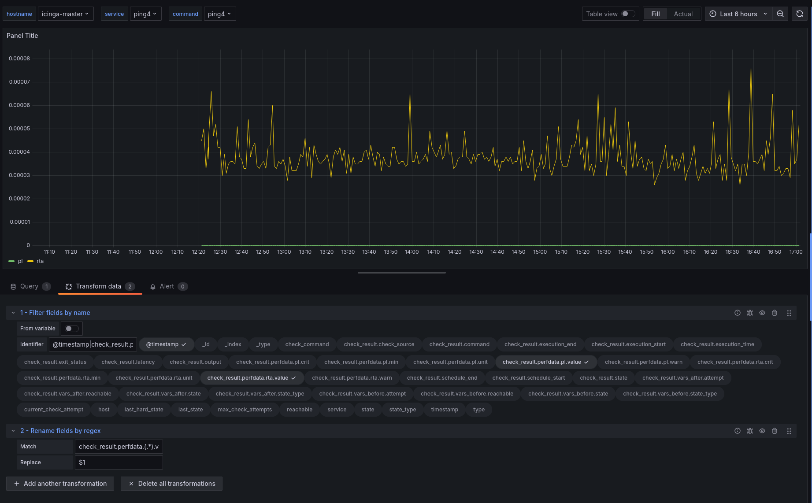
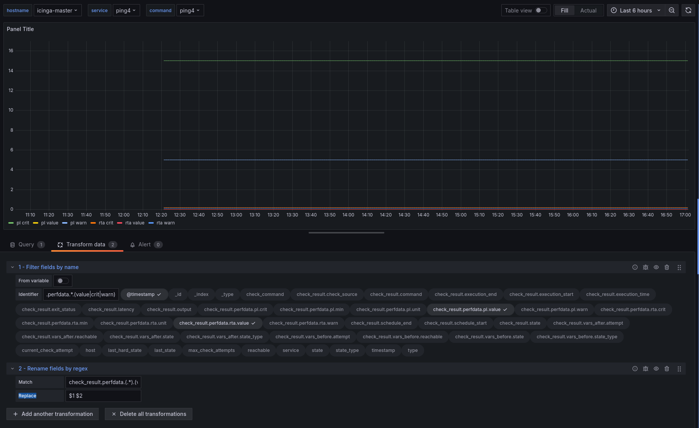

# Create Grafana dashboards for OpenSearch backend

To create your own graphs you need to create a new [dashboard](http://docs.grafana.org/guides/basic_concepts/#dashboard) with a [panel](http://docs.grafana.org/guides/basic_concepts/#panel) in Grafana.
In this example we create a dashboard for the command ping4, open the menu and go to `Dashboards` -> `New`.


First go to the dashboard settings () and change the name to `ITL-ping4`.
Also if you want add description, row names, links etc.
To save your changes, just hit the :floppy_disk: icon.

## Templating

We use templateing to get a map from var-[hostname|servicename|command] to a Grafana variable. We will set this as a query to InfluxDB and later if you want we change it to an constant.
Open the `Templating` settings and hit the  button.
The variable name has to be `hostname`, `service` or `command` for the use with the grafana module.
The `Datasource` should point to your OpenSearch datasource and be of the type [grafana-opensearch-datasource](https://grafana.com/grafana/plugins/grafana-opensearch-datasource/).
This datasourc type is not part of the default installation of grafana, therefore you need to install the plugin to enable it.

 * Hostname query

```
 {"find": "terms", "field": "host.keyword", "size": 1000}
```

 * Service query

```
 {"find": "terms", "field": "service.keyword", "size": 1000}
```

 * Command query

```
 {"find": "terms", "field": "check_command.keyword", "size": 1000}
```

The complete templating should now look like this



Close the templateing and hit the :floppy_disk: icon to save the dashboard we made so far.


## Add Panel (Graph)

Now we add a new `Panel` to our dashboard, click on the 3 points in the left side of the row and choose `Add Panel`


We want to add `Graph`


To edit the graph, move your mouse over the graph title (Panel Title) and click on it.
Choose `Edit` from the opened menu. Now you will see a new menu below the graph.



## Edit Panel Metrics (Metrics Tab)

 1. Change the `Data Source` to your OpenSearch data source if it is not your default data source.
 2. Edit the Lucene Query to: `host:"/^$hostname$/" AND check_command:"/^$command$/" AND service:"/^$service$/"` for a Service Dashboard or to `host:"/^$hostname$/" AND check_command:"/^$command$/" AND -_exists_:service` for a Host Dashboard. This differenciation has to be done because the icinga2 [elasticsearch writer](https://icinga.com/docs/icinga-2/latest/doc/14-features/#elasticsearch-writer) does not set the service field for host checkes.
 3. Change `Luceme Query Type`to `Metric`.
 4. Underneath for the Metric (default is `Count`) select `Raw Data` by clicking on it.

 8. Now we have to filter for the datapoints that are interesting for us. To filter for performance values create a `filter fields by name` Transformation witht he following identifier: `@timestamp|check_result.perfdata.*.value`
 9. Now we can also change the name of the fields with a `rename fields by regex` Transformation and the Match string: `check_result.perfdata.(.*).value` (Replace stays at `$1`).


### Add Critical & Warning (optional)

Adding thresholds will change the Y-axis range, so you will not see as much details of your metric as without them.

 1. For **critical** or **warning** change the filter regex from step 8 to `@timestamp|check_result.perfdata.*.(value|crit|warn)`
 2. To cleanup the names you should then also change the rename regex from step 9 to `check_result.perfdata.(.*).(value|crit|warn)` and the replace to `$1 $2`



## Change axis for second metric/thresholds (pl)

As ping4 has `rta` and `pl` metrics and they have different units, we can use both Y axis.
Change the `pl`, `pl.warn`and `pl.crit` axis by clicking on the small colored line and choose `Right` as `Y Axis`.


^^^^
## Change colors for values/tresholds

To change the colors the quick way just click on the small colored line infront of the metric/thresholds in the legend.


The default Icinga2 color for critical is `#ff5566` and for warning it is `#ffaa44`

Dont forget to hit the :floppy_disk: from time to timee to save your dashboard.

## Change graph title (General tab)

Here enter a title for your graph or leave it empty. If you want to set it to the service name, enter `$service` in the `Title` field.
To make your colleagues happy, enter also a short description (optional), the field support markdown :smiley:.


## Axis Units (Axis tab)

Set the left Y axis unit to `seconds` (Icinga2 stores all time based metrics in seconds) for the `rta` metric.
The left Y axis we set to `percent: (0-100)`, the `Y-Min` and `Decimals` to **0**, because pl is a percentage without decimals.


## Legend (Legend tab)

Activate `As Table`, `Min`, `Max`, `Avg` and `Current` to have some more information shown.
If you want to hide metrics with only **0** in the choosen time range, activate **Hide series** `With only zeros` too.


## Display (Display tab)

### Series overrides for thresholds

For thresholds we remove the the line filling, so they will only be a thin line.
To add a new override click first on `Series overrides` and then on the `+ Add overrides`
Insert `/critical|warning/`(the alias we used in the query) into `alias or regex`, add `Line fill:0` and `Legend: false` to it.


## Final dashboard

### With thresholds


### Without thresholds


