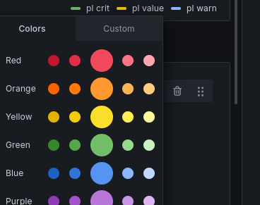
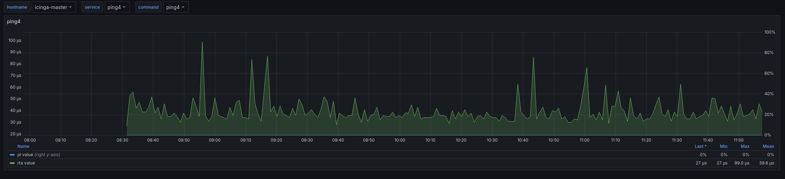

# Create Grafana dashboards for OpenSearch backend

To create your own graphs you need to create a new [dashboard](http://docs.grafana.org/guides/basic_concepts/#dashboard) with a [panel](http://docs.grafana.org/guides/basic_concepts/#panel) in Grafana.
In this example we create a dashboard for the command ping4, open the menu and go to `Dashboards` -> `New` -> `Naw dashboard`.


Now click on `+ Add visualization` and then select your OpensSearch `Datasource`.
The `Datasource` should be of the type [grafana-opensearch-datasource](https://grafana.com/grafana/plugins/grafana-opensearch-datasource/).
This datasourc type is not part of the default installation of grafana, therefore you need to install the plugin to enable it.

You can now click on the green `save` Button on the top-right.
You will be asked to name your new Dashboard for example to the name `ITL-ping4`.
Also if you want, you could create a description.
To save your changes, just hit the `Save` Button.

## Templating

We use templateing to get a map from var-[hostname|servicename|command] to a Grafana variable.
We will set this as a query to OpenSearch and later if you want we change it to an constant.
Open the `dashboard settings` settings by clicking on the :gear:-icon.
Form there select the `Variables` Reader.
You can add new Variables by clicking on the `Add variable` Button.
The variable name has to be `hostname`, `service` or `command` for the use with the grafana module.

 * Hostname query

```
{"find": "terms", "field": "host.keyword", "size": 1000}
```

 * Service query

```
{"find": "terms", "field": "service.keyword", "size": 1000}
```

 * Command query

```
{"find": "terms", "field": "check_command.keyword", "size": 1000}
```

The complete templating should now look like this


Close the options by hitting the `close` button the top-right.
Afterwards hit the :floppy_disk: icon to save the dashboard we made so far.


## Edit Panel (Graph)

To edit the default panel, move your mouse over the panel and clicking on the three dots on the right.
Choose `Edit` from the opened menu.
Now you will see a new menu below an on the right of the graph.


## Edit Panel Metrics (Metrics Tab)

 1. Change the `Data Source` to your OpenSearch data source if it is not your default data source.
 2. Edit the Lucene Query to: `host:"/^$hostname$/" AND check_command:"/^$command$/" AND service:"/^$service$/"` for a Service Dashboard or to `host:"/^$hostname$/" AND check_command:"/^$command$/" AND -_exists_:service` for a Host Dashboard. This differenciation has to be done because the icinga2 [elasticsearch writer](https://icinga.com/docs/icinga-2/latest/doc/14-features/#elasticsearch-writer) does not set the service field for host checkes.
 3. Change `Luceme Query Type`to `Metric`.
 4. Underneath for the Metric (default is `Count`) select `Raw Data` by clicking on it.

 8. Now we have to filter for the datapoints that are interesting for us. To filter for performance values create a `filter fields by name` Transformation witht he following identifier: `@timestamp|check_result.perfdata.*.value`
 9.  Now we can also change the name of the fields with a `rename fields by regex` Transformation and the Match string: `check_result.perfdata.(.*).value` (Replace stays at `$1`).


### Add Critical & Warning (optional)

Adding thresholds will change the Y-axis range, so you will not see as much details of your metric as without them.

 1. For **critical** or **warning** change the filter regex from step 8 to `@timestamp|check_result.perfdata.*.(value|crit|warn)`
 2. To cleanup the names you should then also change the rename regex from step 9 to `check_result.perfdata.(.*).(value|crit|warn)` and the replace to `$1 $2`


## Change axis for second metric/thresholds (Override tab)

As ping4 has `rta` and `pl` metrics and they have different units, we can use both Y axis.
Change the `pl value`, `pl warn`and `pl crit` axis by adding a match by regex override with the string `/pl.*/` and set the axis placement to right.


## Change colors for values/tresholds

To change the colors the quick way just click on the small colored line infront of the metric/thresholds in the legend.



The default Icinga2 color for critical is `rgb(255, 85, 102)` and for warning it is `rgb(255, 170, 68)`

Dont forget to hit the :floppy_disk: from time to timee to save your dashboard.

## Change graph title (All tab)

Here enter a title for your graph or leave it empty. If you want to set it to the service name, enter `$service` in the `Title` field.
To make your colleagues happy, enter also a short description (optional), the field support markdown :smiley:.


## Units (Override tab)

Set the left Y axis unit to `seconds` (Icinga2 stores all time based metrics in seconds) for the `rta` metric.
The left Y axis we set to `percent: (0-100)`, the `Y-Min` and `Decimals` to **0**, because pl is a percentage without decimals.


## Legend (All tab)

Activate `As Table`, `Min`, `Max`, `Avg` and `Last` to have some more information shown.
If you want to hide metrics with only **0** in the choosen time range, activate **Hide series** `With only zeros` too.


## Display (Display tab)

### Series overrides for thresholds

For the values we can add a  we remove the the line filling, so they will only be a thin line.
To add a new override click first on the `Overrides` tab and then on the `+ Add field override`
Insert `/.* value/`(the alias we used in the query) into a `Fields with name matching regex` override, add `Graph styles > Fill opacity` and now you can set a fill to the value line.


## Final dashboard

### With thresholds


### Without thresholds


